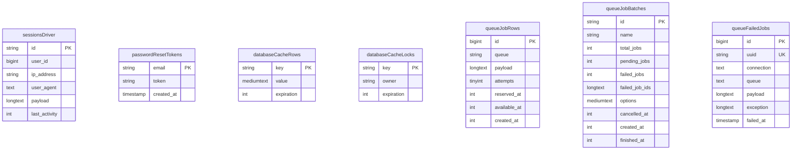

# Database schema

This document reflects the Laravel schema defined by migrations in [`database/migrations`](../database/migrations) (after `php artisan migrate`). **Canonical column-level truth** for nullability, defaults, indexes, and foreign keys is **`## Tables and columns`** below. Mermaid diagrams are relationship overviews only.

_Last aligned with migrations in this repository (no generated column sync to live DB)._

Below is the same layout as the schema plan reference: relationship table first, then one markdown **row per SQL column**.

---

## Relationships (foreign keys)

| Dependent table | FK column | Parent table | Constraint / notes |
|-----------------|-----------|--------------|--------------------|
| `appointments` | `user_id` | `users` | Nullable; FK; `NULL ON DELETE` |
| `appointments` | `service_id` | `services` | Nullable; FK; `NULL ON DELETE` |
| `services` | `gallery_item_id` | `gallery_items` | Nullable; **unique** FK; `NULL ON DELETE` |
| `activity_logs` | `user_id` | `users` | Nullable; FK; `NULL ON DELETE` |
| `otp_challenges` | `user_id` | `users` | Nullable; FK; `NULL ON DELETE` |
| `receipt_records` | `uploaded_by` | `users` | Nullable; FK; `NULL ON DELETE` |
| `security_audit_logs` | `admin_id` | `users` | Nullable; FK; `NULL ON DELETE` |
| `user_notifications` | `user_id` | `users` | **`NOT NULL`** FK; **`CASCADE ON DELETE`** |

### Tables with no FK to other tables in this schema

Domain: `closed_dates`, `contact_settings`.

Laravel internals: `sessions`, `password_reset_tokens`, `cache`, `cache_locks`, `jobs`, `job_batches`, `failed_jobs`.

**Sessions vs users:** `sessions.user_id` is indexed (`foreignId` + `index()`) but **not** `constrained()`, so **no FK row** exists on `sessions`; link is logical only.

---

## Tables and columns

Standard columns: **Column name** \| **Type** (per Laravel blueprint) \| **Nullable** \| **Default** \| **Constraints, indexes & notes**

### `users`

| Column | Type | Nullable | Default | Constraints, indexes & notes |
|--------|------|----------|---------|-------------------------------|
| `id` | `bigIncrements` / unsigned bigint | NO | auto | PK |
| `name` | string(255) | NO | — | |
| `name_stego_png_base64` | longText | YES | — | Stego PNG payload (migration `2026_04_29_000002`) |
| `email` | string(255) | NO | — | **Unique** (`UNIQUE`) |
| `phone` | string(20) | YES | — | Migration `2026_04_02_000002` |
| `email_verified_at` | timestamp | YES | — | |
| `password` | string(255) | NO | — | |
| `role` | string(255) | NO | `'customer'` | **Index** (migration `2026_02_25_081328`) |
| `admin_guard` | unsignedTinyInteger STORED GENERATED _(MySQL only)_ | YES | _(computed)_ | **MySQL:** `storedAs` `CASE WHEN role = 'admin' THEN 1 ELSE NULL END`; **unique index** `unique_admin_role` (`admin_guard`). **PostgreSQL:** no column; partial unique expression index `unique_admin_role` on `(CASE WHEN role = 'admin' THEN 1 ELSE NULL END)` (migration `2026_05_07_120605`) |
| `remember_token` | string(100) | YES | — | From `rememberToken()` |
| `created_at`, `updated_at` | timestamps | YES* | — | *Laravel timestamps nullable unless `$table->timestampsTz()` hardened; migrations use `$table->timestamps()` → nullable in default Laravel |

### `appointments`

| Column | Type | Nullable | Default | Constraints, indexes & notes |
|--------|------|----------|---------|-------------------------------|
| `id` | `bigIncrements` | NO | auto | PK |
| `user_id` | foreignId → `users.id` | YES | — | FK, `NULL ON DELETE`. **Indexes:** standalone index on `user_id` (via Laravel FK); composite `appointments_user_seen_created_idx` (`user_id`, `seen_at`, `created_at`) |
| `service_id` | foreignId → `services.id` | YES | — | FK, `NULL ON DELETE`; **Index** (`2026_04_03`) |
| `appointment_date` | date | NO | — | **Index** (`2026_04_03`) |
| `appointment_time` | string(255) | NO | — | |
| `customer_name` | string(255) | NO | — | |
| `customer_email` | string(255) | NO | — | |
| `customer_phone` | string(255) | NO | — | |
| `customer_stego_png_base64` | longText | YES | — | Migration `2026_04_29_000001` |
| `status` | string(255) | NO | `'pending'` | Comment in migration: pending \| paid \| cancelled. **Index** (`2026_04_03`); composite `appointments_status_cancelled_by_idx` (`status`, `cancelled_by`); overlaps with standalone `status` index |
| `stripe_session_id` | string(255) | YES | — | |
| `stripe_payment_intent_id` | string(255) | YES | — | Migration `2026_04_26_000002` |
| `amount_paid` | unsignedInteger | NO | `0` | Stored in centavos per migration comment |
| `refund_status` | string(255) | YES | — | **Index** `appointments_refund_status_idx` |
| `refund_amount` | unsignedInteger | YES | — | |
| `refund_deduction_amount` | unsignedInteger | YES | — | |
| `refund_reference` | string(255) | YES | — | |
| `refund_processed_at` | timestamp | YES | — | |
| `cancelled_by` | string(255) | YES | — | Composite index with `status` (`appointments_status_cancelled_by_idx`) |
| `cancelled_at` | timestamp | YES | — | |
| `cancellation_note` | text | YES | — | |
| `seen_at` | timestamp | YES | — | Added in refund migration (`2026_04_26_000002`), idempotently guarded in `2026_04_27_000001` |
| `created_at`, `updated_at` | timestamps | YES* | — | **`created_at` index** (`2026_04_03`); part of composite `appointments_user_seen_created_idx`. *Nullable per default `$table->timestamps()` |

### `services`

| Column | Type | Nullable | Default | Constraints, indexes & notes |
|--------|------|----------|---------|-------------------------------|
| `id` | `bigIncrements` | NO | auto | PK |
| `gallery_item_id` | foreignId → `gallery_items.id` | YES | — | FK, `NULL ON DELETE`; **`UNIQUE`** |
| `name` | string(255) | NO | — | |
| `price` | decimal(8, 2) | NO | — | |
| `description` | text | YES | — | |
| `image` | string(255) | YES | — | |
| `metadata_stego_png_base64` | longText | YES | — | Migration `2026_05_10_000001`; PNG with stegano-kit + AES-256-GCM metadata |
| `duration_minutes` | unsignedInteger | NO | `30` | |
| `is_active` | boolean | NO | `true` | Laravel stores as tinyint(1) |
| `sort_order` | unsignedInteger | NO | `0` | |
| `created_at`, `updated_at` | timestamps | YES* | — | |

### `gallery_items`

| Column | Type | Nullable | Default | Constraints, indexes & notes |
|--------|------|----------|---------|-------------------------------|
| `id` | `bigIncrements` | NO | auto | PK |
| `name` | string(255) | NO | — | |
| `description` | text | YES | — | |
| `image` | string(255) | YES | — | |
| `price` | decimal(10, 2) | NO | `0` | Migration `2026_04_02_000001` |
| `is_active` | boolean | NO | `true` | |
| `featured_on_home` | boolean | NO | `false` | Migration `2026_04_02_000000`; **Composite index** `gallery_items_home_featured_idx` (`is_active`, `featured_on_home`, `created_at`) |
| `sort_order` | unsignedInteger | NO | `0` | |
| `created_at`, `updated_at` | timestamps | YES* | — | Covered by `gallery_items_home_featured_idx` on `created_at` |

### `closed_dates`

| Column | Type | Nullable | Default | Constraints, indexes & notes |
|--------|------|----------|---------|-------------------------------|
| `id` | `bigIncrements` | NO | auto | PK |
| `date` | date | NO | — | **Unique** |
| `type` | enum(`closed`,`holiday`) | NO | `'closed'` | |
| `note` | string(255) | YES | — | |
| `is_active` | boolean | NO | `true` | |
| `metadata_stego_png_base64` | longText | YES | — | Migration `2026_05_10_000001`; PNG with embedded closed-date JSON + stegano-kit |
| `created_at`, `updated_at` | timestamps | YES* | — | |

### `activity_logs`

| Column | Type | Nullable | Default | Constraints, indexes & notes |
|--------|------|----------|---------|-------------------------------|
| `id` | `bigIncrements` | NO | auto | PK |
| `user_id` | foreignId → `users.id` | YES | — | FK, `NULL ON DELETE`. **Index** `activity_logs_user_id_idx` |
| `action` | string(255) | NO | — | **Composite index** `activity_logs_action_created_idx` (`action`, `created_at`) |
| `model_type` | string(255) | NO | — | Morph type; composite `activity_logs_model_lookup_idx` (`model_type`, `model_id`) |
| `model_id` | unsignedBigInteger | YES | — | Part of `activity_logs_model_lookup_idx` |
| `description` | string(255) | NO | — | |
| `changes` | json | YES | — | |
| `created_at`, `updated_at` | timestamps | YES* | — | **Index** `activity_logs_created_at_idx`; `created_at` in composites above |

### `contact_settings`

| Column | Type | Nullable | Default | Constraints, indexes & notes |
|--------|------|----------|---------|-------------------------------|
| `id` | `bigIncrements` | NO | auto | PK |
| `location_line_1` | string(255) | NO | — | Seed row inserted in migration `2026_02_28_120000` |
| `location_line_2` | string(255) | YES | — | |
| `hours_line_1` | string(255) | NO | — | |
| `hours_line_2` | string(255) | YES | — | |
| `phone` | string(255) | NO | — | |
| `email` | string(255) | NO | — | |
| `booking_start_time` | time | NO | `'10:00:00'` | Migration `2026_04_05_120000` / ensure migration |
| `booking_end_time` | time | NO | `'17:00:00'` | |
| `booking_interval_minutes` | unsignedSmallInteger | NO | `60` | |
| `created_at`, `updated_at` | timestamps | YES* | — | |

### `otp_challenges`

| Column | Type | Nullable | Default | Constraints, indexes & notes |
|--------|------|----------|---------|-------------------------------|
| `id` | `bigIncrements` | NO | auto | PK |
| `user_id` | foreignId → `users.id` | YES | — | FK, `NULL ON DELETE` |
| `purpose` | string(64) | NO | — | **Composite index** `otp_lookup_idx` (`purpose`, `channel`, `recipient`) |
| `channel` | string(16) | NO | — | Part of `otp_lookup_idx` |
| `recipient` | string(255) | NO | — | Part of `otp_lookup_idx` |
| `code_hash` | string(255) | NO | — | |
| `attempts` | unsignedTinyInteger | NO | `0` | |
| `max_attempts` | unsignedTinyInteger | NO | `5` | |
| `expires_at` | timestamp | NO | — | **Composite index** `otp_active_idx` (`expires_at`, `consumed_at`) |
| `consumed_at` | timestamp | YES | — | Part of `otp_active_idx` |
| `context` | json | YES | — | |
| `created_at`, `updated_at` | timestamps | YES* | — | |

### `receipt_records`

| Column | Type | Nullable | Default | Constraints, indexes & notes |
|--------|------|----------|---------|-------------------------------|
| `id` | `bigIncrements` | NO | auto | PK |
| `transaction_id` | string(255) | NO | — | **Unique** |
| `filename` | string(255) | NO | — | |
| `relative_path` | string(255) | NO | — | |
| `sha256_hash` | char(64) | NO | — | |
| `mime_type` | string(80) | NO | — | |
| `size_bytes` | unsignedBigInteger | YES | — | |
| `uploaded_by` | foreignId → `users.id` | YES | — | FK, `NULL ON DELETE`; column named `uploaded_by` |
| `is_active` | boolean | NO | `true` | **Composite index** (`is_active`, `transaction_id`) — Laravel default name typically `receipt_records_is_active_transaction_id_index` |
| `created_at`, `updated_at` | timestamps | YES* | — | |

### `security_audit_logs`

| Column | Type | Nullable | Default | Constraints, indexes & notes |
|--------|------|----------|---------|-------------------------------|
| `id` | `bigIncrements` | NO | auto | PK |
| `admin_id` | foreignId → `users.id` | YES | — | FK, `NULL ON DELETE`, explicit constrained to `users` |
| `event` | string(255) | NO | — | **Composite index** (`event`, `status`) |
| `status` | string(255) | NO | — | |
| `ip_address` | string(45) | YES | — | |
| `transaction_id` | string(255) | YES | — | **Indexed** (`->index()` on column) |
| `message` | string(255) | YES | — | |
| `context` | json | YES | — | |
| `created_at`, `updated_at` | timestamps | YES* | — | |

### `user_notifications`

| Column | Type | Nullable | Default | Constraints, indexes & notes |
|--------|------|----------|---------|-------------------------------|
| `id` | `bigIncrements` | NO | auto | PK |
| `user_id` | foreignId → `users.id` | NO | — | FK, **`CASCADE ON DELETE`**. Compound index `(user_id, is_read)` from migration `$table->index(['user_id', 'is_read'])` |
| `type` | string(255) | NO | — | |
| `title` | string(255) | NO | — | |
| `message` | text | NO | — | |
| `related_model` | string(255) | YES | — | Polymorphic helper string |
| `related_id` | unsignedBigInteger | YES | — | |
| `is_read` | boolean | NO | `false` | |
| `read_at` | timestamp | YES | — | |
| `created_at`, `updated_at` | timestamps | YES* | — | |

### Laravel: `sessions`

| Column | Type | Nullable | Default | Constraints, indexes & notes |
|--------|------|----------|---------|-------------------------------|
| `id` | string(255) | NO | — | PK |
| `user_id` | unsignedBigInteger | YES | — | Indexed; **no `constrained()` FK** |
| `ip_address` | string(45) | YES | — | |
| `user_agent` | text | YES | — | |
| `payload` | longText | NO | — | |
| `last_activity` | integer | NO | — | **Indexed** |

### Laravel: `password_reset_tokens`

| Column | Type | Nullable | Default | Constraints, indexes & notes |
|--------|------|----------|---------|-------------------------------|
| `email` | string(255) | NO | — | PK |
| `token` | string(255) | NO | — | |
| `created_at` | timestamp | YES | — | |

### Laravel: `cache`

| Column | Type | Nullable | Default | Constraints, indexes & notes |
|--------|------|----------|---------|-------------------------------|
| `key` | string(255) | NO | — | PK |
| `value` | mediumText | NO | — | |
| `expiration` | integer | NO | — | **Indexed** |

### Laravel: `cache_locks`

| Column | Type | Nullable | Default | Constraints, indexes & notes |
|--------|------|----------|---------|-------------------------------|
| `key` | string(255) | NO | — | PK |
| `owner` | string(255) | NO | — | |
| `expiration` | integer | NO | — | **Indexed** |

### Laravel: `jobs`

| Column | Type | Nullable | Default | Constraints, indexes & notes |
|--------|------|----------|---------|-------------------------------|
| `id` | `bigIncrements` | NO | auto | PK |
| `queue` | string(255) | NO | — | **Indexed** |
| `payload` | longText | NO | — | |
| `attempts` | unsignedTinyInteger | NO | — | |
| `reserved_at` | unsignedInteger | YES | — | |
| `available_at` | unsignedInteger | NO | — | |
| `created_at` | unsignedInteger | NO | — | Unix-style int (not Laravel `timestamps()`) |

### Laravel: `job_batches`

| Column | Type | Nullable | Default | Constraints, indexes & notes |
|--------|------|----------|---------|-------------------------------|
| `id` | string(255) | NO | — | PK |
| `name` | string(255) | NO | — | |
| `total_jobs` | integer | NO | — | |
| `pending_jobs` | integer | NO | — | |
| `failed_jobs` | integer | NO | — | |
| `failed_job_ids` | longText | NO | — | |
| `options` | mediumText | YES | — | |
| `cancelled_at` | integer | YES | — | |
| `created_at` | integer | NO | — | |
| `finished_at` | integer | YES | — | |

### Laravel: `failed_jobs`

| Column | Type | Nullable | Default | Constraints, indexes & notes |
|--------|------|----------|---------|-------------------------------|
| `id` | `bigIncrements` | NO | auto | PK |
| `uuid` | string(255) | NO | — | **Unique** |
| `connection` | text | NO | — | |
| `queue` | text | NO | — | |
| `payload` | longText | NO | — | |
| `exception` | longText | NO | — | |
| `failed_at` | timestamp | NO | DB `CURRENT_TIMESTAMP` | `useCurrent()` |

---

### Timestamps caveat

Across tables, Laravel’s `$table->timestamps()` creates nullable `created_at` / `updated_at` unless your project configures non-null timestamps globally. The **Nullable** column marks them **YES*** where this applies—verify against production DB constraints if you have customized schema.

---

## Domain ER diagram

Relationship overview only; **omit long steganography payloads** below. Full columns: **`## Tables and columns`** above.

```mermaid
erDiagram
    users ||--o{ appointments : "optional user bookings"
    users ||--o{ activityLogs : "optional actor"
    users ||--o{ otpChallenges : "optional subject"
    users ||--o{ receiptRecords : "uploadedBy optional"
    users ||--o{ securityAuditLogs : "admin actor optional"
    users ||--o{ userNotifications : "cascade delete on user"
    services ||--o{ appointments : "optional service booked"
    galleryItems ||--o| services : "unique galleryItemId FK"

    users {
        bigint id PK
        string name
        string email UK
        string phone
        timestamp email_verified_at
        string password
        string role
        tinyint admin_guard_mysql_only
        string remember_token
        timestamp created_at
        timestamp updated_at
    }

    appointments {
        bigint id PK
        bigint user_id FK
        bigint service_id FK
        date appointment_date
        string appointment_time
        string customer_name
        string customer_email
        string customer_phone
        string status
        string stripe_session_id
        string stripe_payment_intent_id
        int amount_paid
        string refund_status
        int refund_amount
        int refund_deduction_amount
        string refund_reference
        timestamp refund_processed_at
        string cancelled_by
        timestamp cancelled_at
        text cancellation_note
        timestamp seen_at
        timestamp created_at
        timestamp updated_at
    }

    services {
        bigint id PK
        bigint gallery_item_id FK UK
        string name
        decimal price
        text description
        string image
        int duration_minutes
        boolean is_active
        int sort_order
        timestamp created_at
        timestamp updated_at
    }

    galleryItems {
        bigint id PK
        string name
        text description
        string image
        decimal price
        boolean is_active
        boolean featured_on_home
        int sort_order
        timestamp created_at
        timestamp updated_at
    }

    closedDates {
        bigint id PK
        date calendar_day UK
        string closed_type
        string note
        boolean is_active
        timestamp created_at
        timestamp updated_at
    }

    activityLogs {
        bigint id PK
        bigint user_id FK
        string action
        string model_type
        bigint model_id
        string description
        json changes
        timestamp created_at
        timestamp updated_at
    }

    contactSettings {
        bigint id PK
        string location_line_1
        string location_line_2
        string hours_line_1
        string hours_line_2
        string phone
        string email
        time booking_start_time
        time booking_end_time
        int booking_interval_minutes
        timestamp created_at
        timestamp updated_at
    }

    otpChallenges {
        bigint id PK
        bigint user_id FK
        string purpose
        string channel
        string recipient
        string code_hash
        tinyint attempts
        tinyint max_attempts
        timestamp expires_at
        timestamp consumed_at
        json context
        timestamp created_at
        timestamp updated_at
    }

    receiptRecords {
        bigint id PK
        string transaction_id UK
        string filename
        string relative_path
        char sha256_hash
        string mime_type
        bigint size_bytes
        bigint uploaded_by FK
        boolean is_active
        timestamp created_at
        timestamp updated_at
    }

    securityAuditLogs {
        bigint id PK
        bigint admin_id FK
        string event
        string status
        string ip_address
        string transaction_id
        string message
        json context
        timestamp created_at
        timestamp updated_at
    }

    userNotifications {
        bigint id PK
        bigint user_id FK
        string type
        string title
        text message
        string related_model
        bigint related_id
        boolean is_read
        timestamp read_at
        timestamp created_at
        timestamp updated_at
    }
```

### Entity identifiers vs table names

Mermaid ER node names use camelCase.

| Diagram entity       | Actual table               |
|----------------------|----------------------------|
| `galleryItems`       | `gallery_items`            |
| `activityLogs`       | `activity_logs`             |
| `closedDates`        | `closed_dates`             |
| `contactSettings`    | `contact_settings`         |
| `otpChallenges`      | `otp_challenges`           |
| `receiptRecords`     | `receipt_records`          |
| `securityAuditLogs`  | `security_audit_logs`      |
| `userNotifications`  | `user_notifications`       |

Diagram labels **`calendar_day`** / **`closed_type`** match DB columns **`date`** / **`type`** on **`closed_dates`**.

### Diagram notes only

These repeat context from FK / column tables:

- **`admin_guard_mysql_only`:** MySQL-generated column plus unique guard; Postgres uses expression index only (**see `users` table above**).

- **`services.gallery_item_id`:** Nullable unique FK (optional **1 : 1** from gallery toward service).

## Infrastructure tables (Laravel / framework)

High-level ER only; **`## Tables and columns`** has full Laravel internal attributes.



Diagram entities **`sessionsDriver`**, **`passwordResetTokens`**, **`databaseCacheRows`**, **`databaseCacheLocks`**, **`queueJobRows`**, **`queueJobBatches`**, **`queueFailedJobs`** map to tables **`sessions`**, **`password_reset_tokens`**, **`cache`**, **`cache_locks`**, **`jobs`**, **`job_batches`**, **`failed_jobs`**.

No FKs declare links between those tables or to **`users`**; **`sessions.user_id`** is indexed only (**no FK**).
